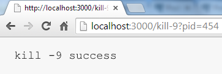

# kill-9
a way to kill node process from client navigator. Something like http://yoursite.kom/kill-9

[](https://npmjs.org/package/kill-9)
[](https://npmjs.org/package/kill-9)
[](https://travis-ci.org/codenautas/kill-9)
[](https://coveralls.io/r/codenautas/kill-9)
[](https://david-dm.org/codenautas/kill-9)

## Install

```sh
$ npm install kill-9
```

## Use it in the client navigator



## API

```js
var express = require('express');
var app = express();

var kill9 = require('kill-9');

var server = app.listen(3000, function() {
    console.log('Listening on port %d', server.address().port);
});

app.use(kill9({log:true}));

// complete example: 
function site_up(req,res){
    var kill_url='kill-9?pid='+process.pid;
    res.send("<h1>kill-9 demo</h1><p>site up<p>try <a href="+kill_url+">"+kill_url+"</a>");
}

app.get('/index.html',site_up);
app.get('/',site_up);
```

### kill9([options])

Returns a function middleware to use with ``express.use``. 
Once installed you can kill the process typing "kill sentence" in the navigator.
Example:

```url
http://thesite.kom/kill-9?pid=12345
```

### options

#### statement *text default "kill-9"*

The statement that you must type in the url. 

#### pid *integer default process.pid*

The pid value that you must pass in the pid parameter. 
By default kill-9 uses the real pid obteined from ``pid`` property of ``process`` object: ``process.pid``

#### log *boolean default false*

If log is set kill-9 show a console.log when it is installed. You can send true or a message.

```js
app.use(kill9({log:"remember to delete in production"}));

// Supose that exists getMode(). This is better
if(getMode()=='develop'){
    app.use(kill9({log:true}));
}
```

#### statusKilled *integer default 200*

The status sent in the response for the case of success.
```js
app.use(kill9({statusKilled:301, location:'other_site.kom'}));
```

#### location *url*

The location for a redirect. This is mandatory if statusKilled between 300 and 303. 

#### messageKilled *text default "kill -9 success"*

The message to display in successful kills. 
```js
app.use(kill9({messageKilled: "I'll be back"}));
```

#### statusBad *integer default 404*

The status sent when the pid doesn't match.

#### locationBad *url*

The location for a redirect. This is mandatory if statusKilled between 300 and 303. 

#### messageBad *text default "kill -9 unknown"*

The message to display when when the pid doesn't match.
```js
app.use(kill9({messageBad: "Not foud"}));
```

#### process *object default process*

The process option is for test purpose. You can pass a *mock object*. 

```js
function ProcessMock(){
    this.pid=444;
    this.codeRecived=null;
    this.exit=function(code){
        this.codeRecived=code;
    }
}

var pm=new ProcessMock();
test_app.use(
    kill9({process:pm})
).get(
    'kill-9?pid=444'
).then(function(){
    assert.equal(mp.codeRecived, 444);
});
```

## Notes

 + **This is not secure in production servers. Use it only in developer servers**. Kill-9 lacks of password or validate user or any way for confirm legal use.
 + Actually options.pid can be a text, but I don't know if this will change in the future. 
 
## License

[GPL-2.0](LICENSE)


